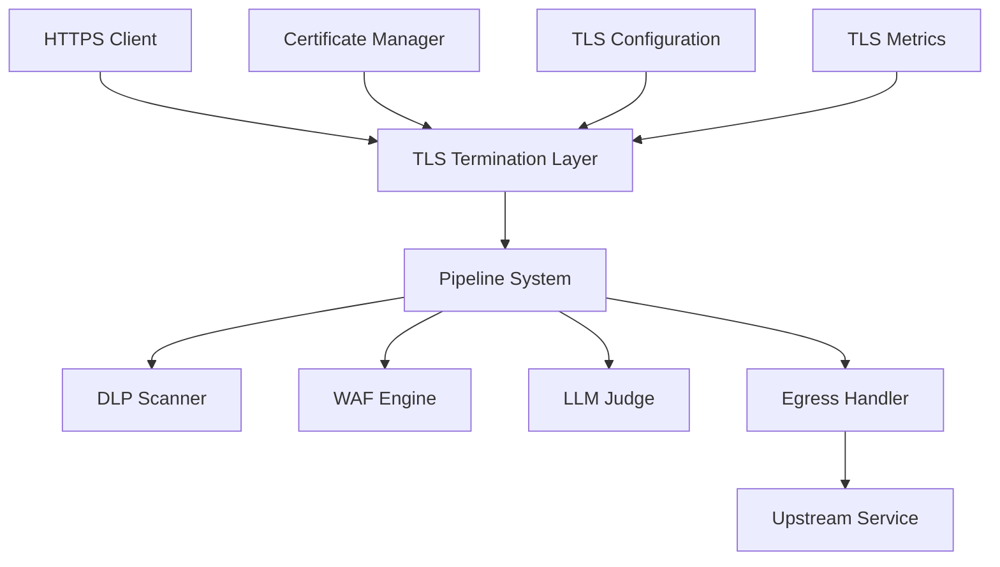

# TLS Termination Design Document

## Overview

This design document outlines the implementation of TLS Termination capability for the Polis proxy system, following Envoy proxy patterns. The solution enables the proxy to terminate HTTPS connections from clients, inspect and process decrypted traffic through existing pipeline systems (DLP, WAF, LLM Judge), and forward traffic to upstream services with flexible encryption options.

The design follows Envoy's approach of using transport sockets for TLS handling, supporting multiple termination modes (HTTPS→HTTP, HTTPS→HTTPS, HTTP→HTTPS), and providing comprehensive certificate management capabilities. The implementation integrates seamlessly with the existing pipeline architecture while maintaining security and performance.

## Architecture

The TLS Termination system consists of several key components:



### Component Responsibilities

1. **TLS Termination Layer**: Handles TLS handshakes, certificate presentation, and traffic decryption/encryption
2. **Certificate Manager**: Loads, validates, and manages TLS certificates and private keys
3. **TLS Configuration**: Manages TLS settings, cipher suites, and protocol versions
4. **Pipeline Integration**: Ensures decrypted traffic flows through existing security pipelines
5. **Upstream TLS Handler**: Manages re-encryption for upstream HTTPS connections

## Components and Interfaces

### TLS Configuration Types

```go
// TLSConfig represents TLS termination configuration
type TLSConfig struct {
    Enabled     bool                    `yaml:"enabled"`
    CertFile    string                  `yaml:"cert_file"`
    KeyFile     string                  `yaml:"key_file"`
    CAFile      string                  `yaml:"ca_file,omitempty"`
    MinVersion  string                  `yaml:"min_version"`
    MaxVersion  string                  `yaml:"max_version,omitempty"`
    CipherSuites []string               `yaml:"cipher_suites,omitempty"`
    ClientAuth  TLSClientAuthConfig     `yaml:"client_auth,omitempty"`
    SNI         map[string]TLSCertConfig `yaml:"sni,omitempty"`
}

// TLSClientAuthConfig configures mutual TLS
type TLSClientAuthConfig struct {
    Required    bool   `yaml:"required"`
    CAFile      string `yaml:"ca_file"`
    VerifyMode  string `yaml:"verify_mode"` // strict, trust-bundle-only
}

// TLSCertConfig represents SNI-specific certificate configuration
type TLSCertConfig struct {
    CertFile string `yaml:"cert_file"`
    KeyFile  string `yaml:"key_file"`
}

// UpstreamTLSConfig configures upstream TLS connections
type UpstreamTLSConfig struct {
    Enabled            bool     `yaml:"enabled"`
    ServerName         string   `yaml:"server_name,omitempty"`
    InsecureSkipVerify bool     `yaml:"insecure_skip_verify"`
    CAFile             string   `yaml:"ca_file,omitempty"`
    CertFile           string   `yaml:"cert_file,omitempty"`
    KeyFile            string   `yaml:"key_file,omitempty"`
    MinVersion         string   `yaml:"min_version"`
    CipherSuites       []string `yaml:"cipher_suites,omitempty"`
}
```

### Server Configuration Extension

```go
// ServerConfig extended to support TLS
type ServerConfig struct {
    AdminAddress string            `yaml:"admin_address"`
    DataAddress  string            `yaml:"data_address"`
    TLS          *TLSConfig        `yaml:"tls,omitempty"`
    ListenParams []ListenParamConfig `yaml:"listen_params,omitempty"`
}

// ListenParamConfig supports multiple listeners with different TLS configs
type ListenParamConfig struct {
    Address  string     `yaml:"address"`
    Protocol string     `yaml:"protocol"` // http, https
    TLS      *TLSConfig `yaml:"tls,omitempty"`
}
```

### Certificate Manager Interface

```go
// CertificateManager handles certificate loading and validation
type CertificateManager interface {
    LoadCertificate(certFile, keyFile string) (*tls.Certificate, error)
    ValidateCertificate(cert *tls.Certificate) error
    GetCertificateForSNI(serverName string) (*tls.Certificate, error)
    ReloadCertificates() error
    WatchCertificateFiles(callback func()) error
}

// TLSTerminator handles TLS termination operations
type TLSTerminator interface {
    BuildServerConfig(config TLSConfig) (*tls.Config, error)
    BuildClientConfig(config UpstreamTLSConfig) (*tls.Config, error)
    HandleConnection(conn net.Conn, pipeline *Pipeline) error
    GetTLSMetrics() TLSMetrics
}
```

## Data Models

### TLS Context Data

```go
// TLSContext holds TLS connection information
type TLSContext struct {
    Version           string            `json:"version"`
    CipherSuite       string            `json:"cipher_suite"`
    ServerName        string            `json:"server_name,omitempty"`
    PeerCertificates  []string          `json:"peer_certificates,omitempty"`
    NegotiatedProtocol string           `json:"negotiated_protocol,omitempty"`
    HandshakeDuration time.Duration     `json:"handshake_duration"`
    ClientAuth        bool              `json:"client_auth"`
}

// TLSMetrics tracks TLS termination metrics
type TLSMetrics struct {
    ConnectionsTotal       int64         `json:"connections_total"`
    ConnectionsActive      int64         `json:"connections_active"`
    HandshakeErrors        int64         `json:"handshake_errors"`
    CertificateErrors      int64         `json:"certificate_errors"`
    HandshakeDuration      time.Duration `json:"avg_handshake_duration"`
    TLSVersionDistribution map[string]int64 `json:"tls_version_distribution"`
    CipherSuiteDistribution map[string]int64 `json:"cipher_suite_distribution"`
}
```

### Pipeline Context Extension

```go
// RequestContext extended with TLS information
type RequestContext struct {
    Method        string
    Path          string
    Host          string
    Headers       map[string][]string
    Protocol      string
    AgentID       string
    TenantID      string
    SessionID     string
    Streaming     bool
    StreamingMode string
    TriggerType   string
    TriggerIndex  int
    TLS           *TLSContext `json:"tls,omitempty"` // New field
}
```

## Correctness Properties

*A property is a characteristic or behavior that should hold true across all valid executions of a system-essentially, a formal statement about what the system should do. Properties serve as the bridge between human-readable specifications and machine-verifiable correctness guarantees.*

Based on the prework analysis, I'll now define the key correctness properties that must be upheld by the TLS termination system:

**Property 1: Certificate Loading Validation**
*For any* valid certificate and private key file pair, the TLS_Termination_System should successfully load and validate the certificate chain and private key
**Validates: Requirements 1.1**

**Property 2: TLS Handshake Completion**
*For any* downstream client connection with valid TLS parameters, the TLS_Termination_System should complete the TLS handshake using the configured certificate
**Validates: Requirements 1.2**

**Property 3: Request Decryption and Pipeline Forwarding**
*For any* successfully completed TLS handshake, the decrypted HTTP request should be forwarded to the Pipeline_System in the same format as standard HTTP requests
**Validates: Requirements 1.3, 5.1**

**Property 4: Response Encryption and Delivery**
*For any* pipeline response, the TLS_Termination_System should encrypt and deliver the response to the downstream client over the established TLS connection
**Validates: Requirements 1.4**

**Property 5: Configuration Error Handling**
*For any* invalid or missing certificate/key configuration, the TLS_Termination_System should return a descriptive configuration error and prevent server startup
**Validates: Requirements 1.5, 4.5**

**Property 6: Self-Signed Certificate Support**
*For any* valid self-signed certificate, the Certificate_Manager should accept and use the certificate for TLS termination
**Validates: Requirements 2.1**

**Property 7: TLS Termination Mode Consistency**
*For any* configured termination mode (HTTPS→HTTP, HTTPS→HTTPS, HTTP→HTTPS), the system should correctly decrypt, process, and forward traffic according to the specified mode
**Validates: Requirements 3.1, 3.2, 3.3**

**Property 8: Upstream Certificate Validation**
*For any* upstream TLS connection, the system should validate upstream certificates using the configured trust store and reject connections with invalid certificates
**Validates: Requirements 3.4, 3.5**

**Property 9: TLS Configuration Compliance**
*For any* TLS configuration, the system should enforce the specified minimum TLS version, cipher suites, and client authentication requirements
**Validates: Requirements 4.1, 4.2, 4.3**

**Property 10: Pipeline Integration Transparency**
*For any* decrypted HTTPS traffic, all pipeline components (DLP, WAF, LLM Judge) should process the traffic identically to HTTP traffic
**Validates: Requirements 5.2, 5.3, 5.4, 5.5**

**Property 11: SNI Certificate Selection**
*For any* client connection with SNI, the system should select the correct certificate based on the server name indication
**Validates: Requirements 7.3**

**Property 12: Certificate Reload Without Disruption**
*For any* certificate file update, the system should reload certificates without dropping existing TLS connections
**Validates: Requirements 4.4, 7.2**

## Error Handling

The TLS Termination system implements comprehensive error handling across multiple layers:

### Certificate Management Errors
- **Invalid Certificate Format**: Detailed parsing errors with specific failure reasons
- **Missing Certificate Files**: Clear file path and permission error messages
- **Certificate Expiration**: Proactive warnings and connection rejection for expired certificates
- **Key Mismatch**: Validation that private keys correspond to certificates

### TLS Handshake Errors
- **Protocol Version Mismatch**: Rejection of connections below minimum TLS version
- **Cipher Suite Negotiation Failure**: Fallback to secure defaults or connection rejection
- **Client Certificate Validation**: Detailed mTLS validation errors
- **SNI Resolution Failure**: Appropriate certificate selection errors

### Pipeline Integration Errors
- **Decryption Failures**: Graceful handling of TLS decryption errors
- **Pipeline Processing Errors**: Proper error propagation from security components
- **Upstream Connection Errors**: TLS validation and connection failure handling

### Configuration Errors
- **Invalid TLS Settings**: Comprehensive validation with descriptive error messages
- **File Permission Issues**: Clear reporting of certificate file access problems
- **Port Binding Conflicts**: Detection and reporting of listener configuration conflicts

## Testing Strategy

The testing strategy employs both unit testing and property-based testing to ensure comprehensive coverage:

### Unit Testing Approach
Unit tests will focus on:
- Certificate loading and validation with known test certificates
- TLS configuration parsing and validation
- Error handling for specific failure scenarios
- Integration points between TLS termination and pipeline components
- Metrics collection and logging functionality

### Property-Based Testing Approach
Property-based tests will verify universal properties using a Go property testing library (such as `gopter` or `rapid`):

**Test Configuration Requirements:**
- Each property-based test will run a minimum of 100 iterations
- Tests will use smart generators that create valid TLS configurations, certificates, and network connections
- Edge cases will be handled through generator constraints rather than separate test cases

**Generator Design:**
- **Certificate Generator**: Creates valid X.509 certificates with varying validity periods, key sizes, and extensions
- **TLS Configuration Generator**: Produces valid TLS configurations with different protocol versions, cipher suites, and authentication modes
- **Network Connection Generator**: Simulates various client connection patterns and handshake scenarios
- **Pipeline Data Generator**: Creates HTTP requests and responses for pipeline integration testing

**Property Test Implementation:**
Each correctness property will be implemented as a single property-based test with explicit tagging:
- Test comments will reference the design document property using the format: `**Feature: tls-termination, Property X: [property description]**`
- Tests will validate the universal quantification ("for any") aspect of each property
- Failure cases will be captured and analyzed to improve generator coverage

### Integration Testing
- End-to-end TLS termination scenarios with real certificates
- Pipeline integration testing with DLP, WAF, and LLM Judge components
- Performance testing under various TLS load patterns
- Certificate rotation and reload testing

### Security Testing
- TLS protocol compliance testing
- Certificate validation edge cases
- Cipher suite security verification
- mTLS authentication testing

## Implementation Architecture

### Core Components

#### TLS Server Implementation
```go
// TLSServer handles TLS termination for incoming connections
type TLSServer struct {
    config       *TLSConfig
    certManager  CertificateManager
    tlsConfig    *tls.Config
    listeners    []net.Listener
    pipeline     PipelineExecutor
    metrics      *TLSMetrics
    logger       *slog.Logger
}

// Start initializes TLS listeners and begins accepting connections
func (s *TLSServer) Start(ctx context.Context) error

// HandleConnection processes individual TLS connections
func (s *TLSServer) HandleConnection(conn net.Conn) error

// Shutdown gracefully closes all listeners and connections
func (s *TLSServer) Shutdown(ctx context.Context) error
```

#### Certificate Management
```go
// FileCertificateManager implements certificate loading from files
type FileCertificateManager struct {
    certificates map[string]*tls.Certificate
    watchers     []fsnotify.Watcher
    reloadChan   chan struct{}
    mutex        sync.RWMutex
}

// LoadCertificate loads and validates a certificate/key pair
func (m *FileCertificateManager) LoadCertificate(certFile, keyFile string) (*tls.Certificate, error)

// GetCertificateForSNI returns the appropriate certificate for SNI
func (m *FileCertificateManager) GetCertificateForSNI(serverName string) (*tls.Certificate, error)
```

#### Pipeline Integration
```go
// TLSPipelineHandler integrates TLS termination with pipeline processing
type TLSPipelineHandler struct {
    executor PipelineExecutor
    selector PipelineSelector
}

// ProcessTLSRequest handles decrypted requests through the pipeline
func (h *TLSPipelineHandler) ProcessTLSRequest(
    ctx context.Context,
    req *http.Request,
    tlsCtx *TLSContext,
) (*http.Response, error)
```

### Configuration Integration

The TLS configuration extends the existing server configuration structure:

```yaml
server:
  admin_address: ":19090"
  data_address: ":8090"
  tls:
    enabled: true
    cert_file: "/path/to/server.crt"
    key_file: "/path/to/server.key"
    min_version: "1.2"
    cipher_suites:
      - "TLS_ECDHE_RSA_WITH_AES_256_GCM_SHA384"
      - "TLS_ECDHE_RSA_WITH_AES_128_GCM_SHA256"
    client_auth:
      required: false
      ca_file: "/path/to/client-ca.crt"
    sni:
      "api.example.com":
        cert_file: "/path/to/api.crt"
        key_file: "/path/to/api.key"

# Alternative multi-listener configuration
server:
  listen_params:
    - address: ":8080"
      protocol: "http"
    - address: ":8443"
      protocol: "https"
      tls:
        cert_file: "/path/to/server.crt"
        key_file: "/path/to/server.key"
        min_version: "1.2"

pipelines:
  - id: "tls-enabled-pipeline"
    version: 1
    description: "Pipeline with TLS termination support"
    agentId: "*"
    protocol: "http"  # Processes decrypted HTTP after TLS termination
    nodes:
      - id: "dlp-scan"
        type: "policy.dlp"
        config:
          rules: ["pii-detection"]
      - id: "waf-check"
        type: "policy.waf"
        config:
          ruleset: "owasp-core"
      - id: "egress"
        type: "egress.http"
        config:
          upstream_url: "https://api.backend.com"
          upstream_tls:
            enabled: true
            server_name: "api.backend.com"
            min_version: "1.2"
```

### Metrics and Observability

The TLS termination system exposes comprehensive metrics:

```go
// TLS-specific metrics
var (
    tlsConnectionsTotal = prometheus.NewCounterVec(
        prometheus.CounterOpts{
            Name: "tls_connections_total",
            Help: "Total number of TLS connections",
        },
        []string{"version", "cipher_suite", "client_auth"},
    )

    tlsHandshakeDuration = prometheus.NewHistogramVec(
        prometheus.HistogramOpts{
            Name: "tls_handshake_duration_seconds",
            Help: "TLS handshake duration",
        },
        []string{"version"},
    )

    tlsCertificateExpiry = prometheus.NewGaugeVec(
        prometheus.GaugeOpts{
            Name: "tls_certificate_expiry_timestamp",
            Help: "Certificate expiry timestamp",
        },
        []string{"cert_file", "subject"},
    )
)
```

### Security Considerations

1. **Certificate Storage**: Private keys should be stored with restricted file permissions (600)
2. **Memory Protection**: Certificate private keys should be cleared from memory when possible
3. **Protocol Security**: Default to TLS 1.2+ with secure cipher suites
4. **Certificate Validation**: Implement strict certificate chain validation
5. **SNI Security**: Prevent information leakage through SNI certificate selection
6. **Error Handling**: Avoid exposing sensitive information in error messages

This design provides a robust, secure, and performant TLS termination capability that integrates seamlessly with the existing Polis proxy architecture while following Envoy's proven patterns for TLS handling.
