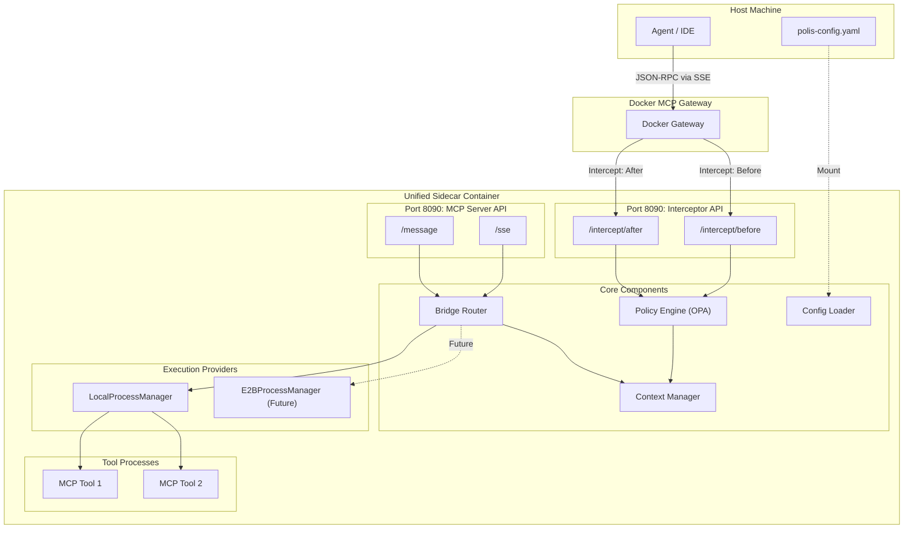
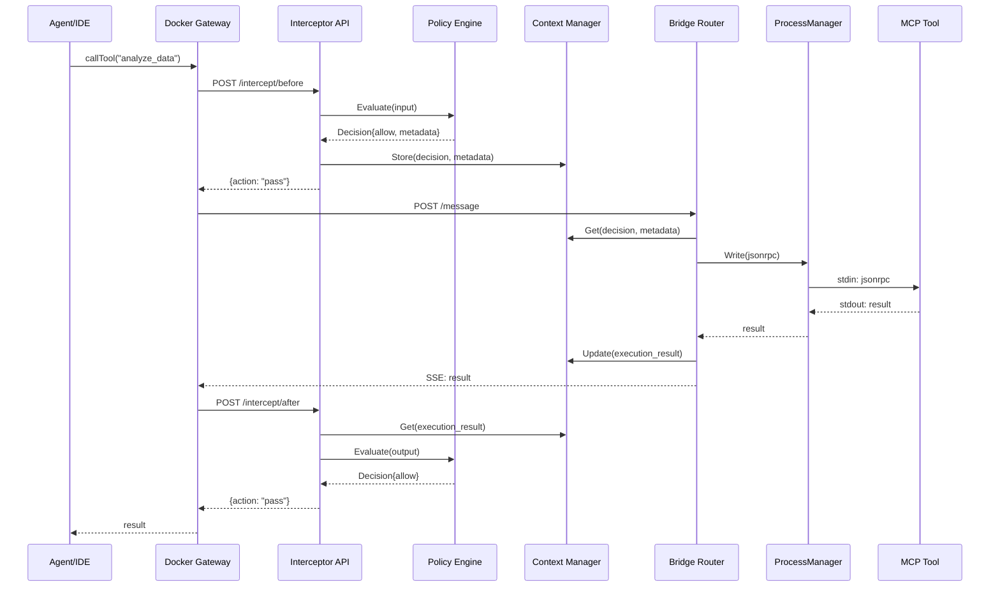

# Unified Sidecar Design Document

## Overview

This design document describes the architecture for consolidating Polis into a **Unified Sidecar** that combines governance (policy enforcement) and MCP bridging (tool execution) into a single, lightweight container. The unified sidecar replaces the current two-binary deployment (`polis-core` + `polis-bridge`) with a single binary that:

1. Acts as a **Governance Interceptor** for Docker MCP Gateway
2. Provides **MCP Server capabilities** for Stdio-to-HTTP/SSE bridging
3. Shares context between governance and execution without network hops
4. Prepares for future **E2B sandbox integration**

The design prioritizes backward compatibility with existing configurations while enabling the new unified deployment model.

## Architecture



### Request Flow



## Components and Interfaces

### 1. Unified Sidecar Entry Point

The main binary consolidates both interceptor and bridge functionality:

```go
// cmd/polis/main.go
package main

// SidecarConfig holds the unified configuration
type SidecarConfig struct {
    // Server configuration
    InterceptorAddr string `yaml:"interceptor_addr"` // Default: ":8090"
    MCPServerAddr   string `yaml:"mcp_server_addr"`  // Default: ":8090"
    
    // Policy configuration
    Policies PolicyConfig `yaml:"policies"`
    
    // Tool definitions
    Tools []ToolConfig `yaml:"tools"`
    
    // Shared settings
    ShutdownTimeout time.Duration `yaml:"shutdown_timeout"`
    LogLevel        string        `yaml:"log_level"`
    Metrics         MetricsConfig `yaml:"metrics"`
}

// Sidecar is the unified container combining interceptor and bridge
type Sidecar struct {
    config         *SidecarConfig
    interceptor    *InterceptorServer
    mcpServer      *MCPServer
    policyEngine   *policy.Engine
    bridgeRouter   *BridgeRouter
    contextManager *ContextManager
    configLoader   *ConfigLoader
    logger         *slog.Logger
}

func (s *Sidecar) Start(ctx context.Context) error
func (s *Sidecar) Stop(ctx context.Context) error
func (s *Sidecar) Health() *HealthStatus
```

### 2. Interceptor Server

Handles Docker Gateway intercept hooks:

```go
// pkg/sidecar/interceptor.go
package sidecar

// InterceptorServer handles Docker Gateway intercept requests
type InterceptorServer struct {
    policyEngine   *policy.Engine
    contextManager *ContextManager
    httpServer     *http.Server
    logger         *slog.Logger
}

// InterceptRequest represents a Docker Gateway intercept request
type InterceptRequest struct {
    Type      string          `json:"type"`      // "before" or "after"
    RequestID string          `json:"request_id"`
    Method    string          `json:"method"`    // JSON-RPC method
    Params    json.RawMessage `json:"params"`
    ToolID    string          `json:"tool_id"`
    AgentID   string          `json:"agent_id"`
}

// InterceptResponse represents the interceptor's decision
type InterceptResponse struct {
    Action       string          `json:"action"`        // "pass", "block", "modify"
    Reason       string          `json:"reason,omitempty"`
    ModifiedData json.RawMessage `json:"modified_data,omitempty"`
    Metadata     map[string]any  `json:"metadata,omitempty"`
}

// HTTP Endpoints
func (s *InterceptorServer) handleInterceptBefore(w http.ResponseWriter, r *http.Request)
func (s *InterceptorServer) handleInterceptAfter(w http.ResponseWriter, r *http.Request)
func (s *InterceptorServer) handleHealth(w http.ResponseWriter, r *http.Request)
```

### 3. Bridge Router

Routes tool calls to appropriate execution providers:

```go
// pkg/sidecar/bridge_router.go
package sidecar

// RuntimeType defines the execution provider type
type RuntimeType string

const (
    RuntimeLocal RuntimeType = "local"
    RuntimeE2B   RuntimeType = "e2b"
)

// BridgeRouter routes tool calls to execution providers
type BridgeRouter struct {
    tools          map[string]*ToolConfig
    localPM        *LocalProcessManager
    e2bPM          ProcessManager // Future: E2BProcessManager
    contextManager *ContextManager
    logger         *slog.Logger
    mu             sync.RWMutex
}

// ToolConfig defines a tool and its execution settings
type ToolConfig struct {
    Name        string            `yaml:"name"`
    Command     []string          `yaml:"command"`
    WorkDir     string            `yaml:"work_dir"`
    Env         []string          `yaml:"env"`
    Runtime     RuntimeConfig     `yaml:"runtime"`
    Description string            `yaml:"description"`
}

// RuntimeConfig specifies the execution provider
type RuntimeConfig struct {
    Type     RuntimeType   `yaml:"type"`     // "local" or "e2b"
    Template string        `yaml:"template"` // E2B template ID
    Timeout  time.Duration `yaml:"timeout"`  // Execution timeout
}

func (r *BridgeRouter) Route(ctx context.Context, toolID string, request []byte) (ProcessManager, error)
func (r *BridgeRouter) RegisterTool(config *ToolConfig) error
func (r *BridgeRouter) GetTool(toolID string) (*ToolConfig, error)
func (r *BridgeRouter) ListTools() []*ToolConfig
```

### 4. ProcessManager Interface

Abstraction for local and remote execution:

```go
// pkg/sidecar/process_manager.go
package sidecar

// ProcessManager handles process lifecycle for tool execution
type ProcessManager interface {
    // Start spawns the process/sandbox
    Start(ctx context.Context, config ProcessConfig) error
    
    // Write sends data to the process stdin
    Write(data []byte) error
    
    // ReadLoop continuously reads stdout and calls handler
    ReadLoop(handler func([]byte)) error
    
    // Stop gracefully terminates the process
    Stop(timeout time.Duration) error
    
    // IsRunning returns true if process is active
    IsRunning() bool
    
    // ExitCode returns the exit code (valid after exit)
    ExitCode() int
    
    // Type returns the runtime type
    Type() RuntimeType
}

// ProcessConfig holds process startup configuration
type ProcessConfig struct {
    Command []string
    WorkDir string
    Env     []string
    Timeout time.Duration
}

// LocalProcessManager implements ProcessManager for local execution
type LocalProcessManager struct {
    cmd      *exec.Cmd
    stdin    io.WriteCloser
    stdout   io.ReadCloser
    stderr   io.ReadCloser
    logger   *slog.Logger
    metrics  *Metrics
    running  bool
    mu       sync.RWMutex
}

// E2BProcessManager implements ProcessManager for E2B sandboxes (future)
type E2BProcessManager struct {
    sandboxID string
    apiKey    string
    template  string
    client    *e2b.Client // Future: E2B SDK client
    logger    *slog.Logger
    running   bool
    mu        sync.RWMutex
}
```

### 5. Context Manager

Shares context between interceptor and bridge:

```go
// pkg/sidecar/context_manager.go
package sidecar

// ContextManager manages shared context between components
type ContextManager struct {
    contexts map[string]*RequestContext
    mu       sync.RWMutex
    ttl      time.Duration
    logger   *slog.Logger
}

// RequestContext holds shared state for a request lifecycle
type RequestContext struct {
    RequestID        string
    AgentID          string
    ToolID           string
    CreatedAt        time.Time
    
    // Interceptor decision
    PolicyDecision   *PolicyDecision
    
    // Execution state
    ExecutionStarted time.Time
    ExecutionEnded   time.Time
    ExitCode         int
    
    // Shared metadata
    Metadata         map[string]any
    
    mu sync.RWMutex
}

// PolicyDecision captures the interceptor's evaluation result
type PolicyDecision struct {
    Action    string
    Reason    string
    Timestamp time.Time
    Metadata  map[string]any
}

func (cm *ContextManager) Create(requestID, agentID, toolID string) *RequestContext
func (cm *ContextManager) Get(requestID string) (*RequestContext, error)
func (cm *ContextManager) SetPolicyDecision(requestID string, decision *PolicyDecision) error
func (cm *ContextManager) SetExecutionResult(requestID string, exitCode int, metadata map[string]any) error
func (cm *ContextManager) Delete(requestID string)
func (cm *ContextManager) Cleanup() // Removes expired contexts
```

### 6. Config Loader

Handles unified configuration with hot-reload:

```go
// pkg/sidecar/config_loader.go
package sidecar

// ConfigLoader manages configuration loading and hot-reload
type ConfigLoader struct {
    path       string
    current    *SidecarConfig
    watcher    *fsnotify.Watcher
    onChange   func(*SidecarConfig) error
    logger     *slog.Logger
    mu         sync.RWMutex
}

func (cl *ConfigLoader) Load() (*SidecarConfig, error)
func (cl *ConfigLoader) Watch(onChange func(*SidecarConfig) error) error
func (cl *ConfigLoader) Current() *SidecarConfig
func (cl *ConfigLoader) Close() error

// expandEnvVars expands ${VAR} syntax in configuration values
func expandEnvVars(value string) string
```

## Data Models

### Unified Configuration Schema

```yaml
# polis-config.yaml
version: "1.0"

# Server configuration
server:
  interceptor_addr: ":8090"
  mcp_server_addr: ":8090"
  shutdown_timeout: 10s
  
  # Optional: Use single port with path routing
  # single_port: ":8090"

# Policy configuration
policies:
  bundles:
    - id: "mcp-governance"
      path: "/policies/mcp"
      entrypoint: "mcp/authz"
    - id: "elicitation"
      path: "/policies/elicitation"
      entrypoint: "mcp/elicitation"

# Tool definitions
tools:
  - name: "filesystem"
    command: ["npx", "-y", "@modelcontextprotocol/server-filesystem", "/workspace"]
    runtime:
      type: local
    description: "Filesystem access tool"
    
  - name: "data-analyzer"
    command: ["python", "analyze.py"]
    runtime:
      type: e2b
      template: "data-science-v1"
      timeout: 300s
    description: "Data analysis in sandbox"

# Metrics and observability
metrics:
  enabled: true
  path: "/metrics"
  tracing:
    enabled: true
    endpoint: "http://jaeger:14268/api/traces"

# Logging
logging:
  level: "info"
  format: "json"

# Secret references (values from environment)
secrets:
  e2b_api_key: "${E2B_API_KEY}"
```

### Interceptor Request/Response Schema

```go
// InterceptBeforeRequest from Docker Gateway
type InterceptBeforeRequest struct {
    Version   string          `json:"version"`   // "1.0"
    Type      string          `json:"type"`      // "before"
    RequestID string          `json:"request_id"`
    Timestamp time.Time       `json:"timestamp"`
    
    // MCP Request details
    Method    string          `json:"method"`
    Params    json.RawMessage `json:"params"`
    
    // Context
    ToolID    string          `json:"tool_id"`
    AgentID   string          `json:"agent_id"`
    SessionID string          `json:"session_id"`
}

// InterceptAfterRequest from Docker Gateway
type InterceptAfterRequest struct {
    Version   string          `json:"version"`
    Type      string          `json:"type"`      // "after"
    RequestID string          `json:"request_id"`
    Timestamp time.Time       `json:"timestamp"`
    
    // MCP Response details
    Result    json.RawMessage `json:"result,omitempty"`
    Error     *JSONRPCError   `json:"error,omitempty"`
    
    // Context
    ToolID    string          `json:"tool_id"`
    AgentID   string          `json:"agent_id"`
    SessionID string          `json:"session_id"`
}
```

### Metrics Schema

| Metric Name | Type | Labels | Description |
|-------------|------|--------|-------------|
| `polis_sidecar_intercept_total` | Counter | type, action, tool_id | Total intercept requests |
| `polis_sidecar_intercept_duration_seconds` | Histogram | type, tool_id | Intercept evaluation latency |
| `polis_sidecar_policy_decisions_total` | Counter | action, bundle_id | Policy decisions by action |
| `polis_sidecar_tool_executions_total` | Counter | tool_id, runtime_type, status | Tool execution count |
| `polis_sidecar_tool_execution_duration_seconds` | Histogram | tool_id, runtime_type | Tool execution latency |
| `polis_sidecar_process_status` | Gauge | tool_id, runtime_type | Process running status (1=running) |
| `polis_sidecar_context_active` | Gauge | - | Active request contexts |
| `polis_sidecar_config_reloads_total` | Counter | status | Configuration reload attempts |


## Correctness Properties

*A property is a characteristic or behavior that should hold true across all valid executions of a system-essentially, a formal statement about what the system should do. Properties serve as the bridge between human-readable specifications and machine-verifiable correctness guarantees.*

Based on the acceptance criteria analysis, the following correctness properties must be validated through property-based testing:

### Property 1: Configuration Parsing Consistency

*For any* valid unified configuration YAML containing policies and tools sections, parsing the configuration SHALL produce a SidecarConfig with all policy bundles and tool definitions correctly populated.

**Validates: Requirements 1.3, 5.1, 5.2, 5.3**

### Property 2: Context Sharing Lifecycle

*For any* request processed through the interceptor, the context manager SHALL:
- Store the policy decision after interceptor evaluation
- Provide access to the decision during bridge execution
- Update with execution results after tool completion
- Make execution context available for after-intercept evaluation
- Clean up all context data when the session ends

**Validates: Requirements 1.4, 7.1, 7.2, 7.3, 7.4, 7.5**

### Property 3: Policy Decision Mapping

*For any* policy evaluation result:
- If action is "allow", the interceptor response SHALL have action "pass"
- If action is "block", the interceptor response SHALL have action "block" with the reason included
- If action is "redact", the interceptor response SHALL have action "modify" with modified data

**Validates: Requirements 2.2, 2.3, 2.4**

### Property 4: Intercept Request Evaluation

*For any* intercept request (before or after), the interceptor SHALL invoke the policy engine with the JSON-RPC payload, tool ID, and agent ID as input.

**Validates: Requirements 2.1, 2.5**

### Property 5: Bridge Router Runtime Resolution

*For any* tool call:
- If the tool has `runtime.type: local`, the router SHALL return a LocalProcessManager
- If the tool has `runtime.type: e2b`, the router SHALL return an error (not implemented)
- If the tool has no runtime config, the router SHALL default to LocalProcessManager

**Validates: Requirements 3.1, 3.3, 3.4**

### Property 6: ProcessManager Interface Consistency

*For any* ProcessManager implementation (Local or E2B), calling Start, Write, ReadLoop, and Stop SHALL behave consistently according to the interface contract, and write failures SHALL return errors without crashing.

**Validates: Requirements 4.3, 4.4**

### Property 7: Process Exit Event Handling

*For any* child process that exits unexpectedly, the ProcessManager SHALL emit an event that allows the bridge to perform cleanup, and the sidecar SHALL remain operational.

**Validates: Requirements 4.5, 9.2**

### Property 8: Configuration Hot-Reload Atomicity

*For any* configuration file change:
- If validation succeeds, the new configuration SHALL be fully applied
- If validation fails, the previous configuration SHALL be retained unchanged
- Partial configuration states SHALL NOT occur

**Validates: Requirements 5.5, 9.5**

### Property 9: Health Status Aggregation

*For any* health check request on either port, the response SHALL include the combined status of all components (interceptor, bridge, policy engine, active tools).

**Validates: Requirements 6.4**

### Property 10: Metrics Emission Consistency

*For any* request processed through the sidecar:
- Intercept metrics SHALL include type, action, and tool_id labels
- Policy decision metrics SHALL include action, bundle_id, and latency
- Tool execution metrics SHALL include tool_id, runtime_type, duration, and exit_code

**Validates: Requirements 8.1, 8.3, 8.4**

### Property 11: Trace Context Propagation

*For any* request with tracing enabled, the trace context SHALL be propagated from the interceptor through the bridge to the tool execution, maintaining the same trace ID across all spans.

**Validates: Requirements 8.2**

### Property 12: Serialization Round-Trip

*For any* SSE event or JSON-RPC message, parsing then serializing SHALL produce output that is semantically equivalent to the input, preserving all fields including multi-line data and special characters.

**Validates: Requirements 10.1, 10.2, 10.3, 10.4, 10.5**

### Property 13: Environment Variable Expansion

*For any* configuration value containing `${VAR}` syntax, the config loader SHALL expand the environment variable before parsing, and missing required secrets SHALL cause startup failure with a clear error message.

**Validates: Requirements 12.1, 12.3, 12.5**

### Property 14: Secret Redaction in Logs

*For any* log message that would contain secret values, the logger SHALL redact the values and show only the key names.

**Validates: Requirements 12.4**

### Property 15: Graceful Shutdown

*For any* shutdown signal, the sidecar SHALL terminate all child processes and close all connections within the configured timeout, leaving no orphaned processes.

**Validates: Requirements 1.5**

### Property 16: E2B Runtime Configuration Parsing

*For any* tool configuration with `runtime.type: e2b`, the configuration parser SHALL accept template and timeout settings as valid fields.

**Validates: Requirements 11.2**

## Error Handling

### Interceptor Errors

| Error Condition | Response | Recovery |
|-----------------|----------|----------|
| Policy engine not loaded | Pass-through (allow) | Log warning, continue |
| Policy evaluation timeout | Block request | Log error, emit metric |
| Invalid intercept request | 400 Bad Request | Log warning |
| Context manager unavailable | Pass-through (allow) | Log error, continue |

### Bridge Router Errors

| Error Condition | Response | Recovery |
|-----------------|----------|----------|
| Tool not found | 404 Not Found | Log warning |
| E2B runtime requested | 501 Not Implemented | Log info |
| Process start failure | 503 Service Unavailable | Mark tool unavailable |
| Process write failure | 500 Internal Server Error | Log error, return error |

### Configuration Errors

| Error Condition | Response | Recovery |
|-----------------|----------|----------|
| Invalid YAML syntax | Startup failure | Exit with error |
| Missing required field | Startup failure | Exit with error |
| Invalid policy path | Log warning | Skip policy bundle |
| Hot-reload validation failure | Retain previous config | Log error, emit alert |

### Context Manager Errors

| Error Condition | Response | Recovery |
|-----------------|----------|----------|
| Context not found | Create new context | Log debug |
| Context expired | Return error | Cleanup context |
| Storage full | Evict oldest contexts | Log warning |

## Testing Strategy

### Dual Testing Approach

This implementation uses both unit tests and property-based tests:

- **Unit tests** verify specific examples, edge cases, and integration points
- **Property-based tests** verify universal properties that should hold across all inputs

### Property-Based Testing Framework

The implementation SHALL use **rapid** (https://github.com/flyingmutant/rapid) for property-based testing in Go. This library provides:
- Automatic shrinking of failing examples
- Reproducible test runs with seed values
- Rich generator combinators

### Test Configuration

- Each property-based test SHALL run a minimum of **100 iterations**
- Each property-based test SHALL be tagged with a comment referencing the correctness property: `// **Feature: unified-sidecar, Property {number}: {property_text}**`

### Unit Test Coverage

Unit tests SHALL cover:

1. **Interceptor Server**
   - Before/after intercept request handling
   - Policy decision to response mapping
   - Invalid request handling

2. **Bridge Router**
   - Tool registration and lookup
   - Runtime type resolution
   - Default runtime behavior

3. **ProcessManager**
   - Process start/stop lifecycle
   - Write and read operations
   - Error handling

4. **Context Manager**
   - Context creation and retrieval
   - Policy decision storage
   - Execution result updates
   - Cleanup and expiration

5. **Config Loader**
   - YAML parsing
   - Environment variable expansion
   - Hot-reload detection
   - Validation errors

### Property-Based Test Coverage

Property tests SHALL cover all 16 correctness properties defined above, with generators for:

1. **Configuration**: Random valid YAML configurations with policies and tools
2. **Intercept Requests**: Random JSON-RPC payloads with various methods and params
3. **Policy Decisions**: Random allow/block/redact decisions with metadata
4. **SSE Events**: Random event types, data content (including multi-line, special chars)
5. **Tool Configs**: Random tool definitions with various runtime settings

### Integration Test Scenarios

1. **End-to-End Intercept Flow**
   - Send intercept request
   - Verify policy evaluation
   - Verify context storage
   - Verify response format

2. **End-to-End Bridge Flow**
   - Start tool via bridge
   - Send JSON-RPC message
   - Verify tool execution
   - Verify response streaming

3. **Context Sharing**
   - Intercept before request
   - Execute tool
   - Intercept after request
   - Verify context available at each step

4. **Hot-Reload**
   - Start sidecar with config
   - Modify config file
   - Verify reload within 5 seconds
   - Verify new config applied

5. **Graceful Shutdown**
   - Start sidecar with active tools
   - Send shutdown signal
   - Verify all processes terminated
   - Verify clean exit

## Migration Strategy

### Phase 1: Interface Extraction

1. Extract `ProcessManager` interface from existing `pkg/bridge`
2. Rename existing implementation to `LocalProcessManager`
3. Ensure all tests pass with refactored code

### Phase 2: Context Manager

1. Create `ContextManager` component
2. Integrate with existing `SessionManager`
3. Add context sharing between components

### Phase 3: Interceptor Server

1. Create new `InterceptorServer` component
2. Implement Docker Gateway intercept protocol
3. Integrate with existing policy engine

### Phase 4: Bridge Router

1. Create `BridgeRouter` component
2. Implement runtime type resolution
3. Integrate with `ProcessManager` interface

### Phase 5: Unified Binary

1. Create new `cmd/polis` entry point
2. Consolidate configuration loading
3. Implement single-port HTTP server
4. Deprecate separate `polis-bridge` and `polis-core` binaries

### Phase 6: E2B Preparation

1. Define `E2BProcessManager` interface stub
2. Add E2B configuration schema
3. Implement "not implemented" error for E2B runtime

### Backward Compatibility

- Existing `polis-bridge` CLI will continue to work
- Existing `polis-core` configuration will be supported
- Migration path documented for existing deployments
