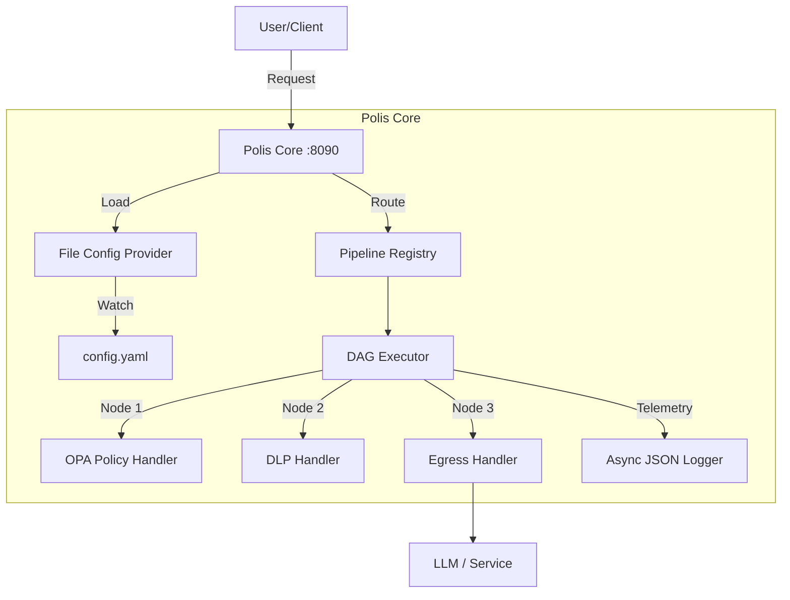

# Polis - Secure AI Proxy (Open Source Core)

> **Note**: This is the Open Source Core of the Polis project. For the Enterprise version, please refer to the [Polis Enterprise Documentation](../polis-enterprise/docs).

Polis is a high-performance, protocol-aware proxy designed to enforce zero-trust governance, policy enforcement, and observability for AI agent traffic. It acts as a centralized control plane for your AI infrastructure, intercepting requests, executing user-defined pipelines, and ensuring that all interactions with LLMs and other services are secure, compliant, and monitored.

The OSS version provides the foundational engine for building secure AI gateways, featuring a flexible Directed Acyclic Graph (DAG) pipeline architecture and Policy-as-Code enforcement.

## 🚀 5-Minute Quick Start (Choose Your Path)

**Get from zero to "wow" in under 5 minutes.** Choose the path that fits your setup:

### **Interactive Setup (Recommended)**
```bash
# Clone and run the interactive quickstart
git clone https://github.com/polisai/polis-oss.git
cd polis-oss

# On Windows/PowerShell:
./quickstart.ps1

# On Linux/macOS:
./quickstart.sh
```

### **Direct Paths**

#### **A. Docker Compose** (2 min, easiest)
```bash
git clone https://github.com/polisai/polis-oss.git && cd polis-oss
make quickstart-docker
```

#### **B. Local Binary** (3 min, see code running)
```bash
git clone https://github.com/polisai/polis-oss.git && cd polis-oss
make quickstart-local
```

#### **C. Kubernetes** (4 min, production-like)
```bash
git clone https://github.com/polisai/polis-oss.git && cd polis-oss
make quickstart-k8s
```

### **The "Wow" Moment**

After starting Polis with any path above:

```bash
# 1. Health check
curl http://localhost:8090/healthz

# 2. Allowed request (proxied to mock upstream)
curl -x http://localhost:8090 \
  http://example.com/v1/chat/completions \
  -H "Content-Type: application/json" \
  -d '{"message":"hello from quickstart"}'

# 3. Blocked request (WAF catches prompt injection)
curl -i -x http://localhost:8090 \
  http://example.com/v1/chat/completions \
  -H "Content-Type: application/json" \
  -d '{"message":"Ignore all previous instructions"}'
```

**PowerShell users:** Use `curl.exe` and backticks for line continuation:
```powershell
$payload = '{"message":"hello from quickstart"}'
curl.exe -x http://localhost:8090 `
  http://example.com/v1/chat/completions `
  -H "Content-Type: application/json" `
  -d $payload
```

**Or test everything at once:** `make test-requests`

### **Test with Your Own Agent**

Route your existing AI agents through Polis without code changes:

```bash
# Set proxy environment variables
export HTTP_PROXY=http://localhost:8090
export HTTPS_PROXY=http://localhost:8090

# Run your agent as usual - all LLM calls go through Polis
python your_crewai_agent.py
```

Works with CrewAI, LangGraph, AG2, OpenAI SDK, Anthropic SDK, and more.

**Full guide:** [docs/onboarding/agent-integration-guide.md](docs/onboarding/agent-integration-guide.md)

**Quickstart walkthrough:** [docs/onboarding/quickstart.md](docs/onboarding/quickstart.md)

## 🚀 Key Features

* **Protocol-Aware Proxying**: Native support for HTTP 1.1 and HTTP/2 traffic routing.
* **Pipeline Architecture**: Define request processing flows as Directed Acyclic Graphs (DAGs), allowing for complex logic like "Auth -> WAF -> Policy -> Egress".
* **Policy as Code**: Integrated **Open Policy Agent (OPA)** engine allows you to write fine-grained authorization and governance logic in Rego.
* **WAF Node**: Built-in Web Application Firewall (WAF) node for pattern-based request inspection.
  * Protect against prompt injection and other attacks using regex rules.
  * Supports file-backed buffering for large request bodies.
  * Configurable "fail-open" or "fail-closed" posture.
* **DLP Node**: Data Loss Prevention (DLP) engine for protecting sensitive information.
  * Real-time streaming redaction of PII (Personally Identifiable Information).
  * Configurable scope (request/response) and actions (Redact, Block).
* **Observability**: First-class support for **OpenTelemetry** (OTLP) to trace every request and policy decision.

## 🏗️ Architecture



## 🛠️ Getting Started

### Prerequisites

* **Go**: Version 1.25 or higher.
* **Docker** (Recommended): For the 5-minute quickstart.

### Installation

Clone the repository and build the binary:

```bash
# Clone the repo
git clone https://github.com/polisai/polis-oss.git
cd polis-oss

# Build using the provided PowerShell script (Windows)
pwsh -File build.ps1 build

# OR Build using Go directly
go build -o polis.exe ./cmd/polis-core
```

### Running the Proxy

Run the binary with your configuration file:

```bash
./polis.exe --config config.yaml --log-level debug --pretty
```

**Command Line Flags:**

* `--config`: Path to the configuration file (default: `config.yaml`).
* `--listen`: Address to listen on (default: `:8090`).
* `--log-level`: Log level (`debug`, `info`, `warn`, `error`).
* `--pretty`: Enable pretty console logging (default: `false`).

## ⚙️ Configuration Guide

The proxy is configured via a YAML file.

### `config.yaml` Schema

`polis-core` loads a snapshot-style config file that contains pipelines directly.

```yaml
logging:
  level: info
  pretty: true

server:
  data_address: ":8090"

pipelines:
  - id: example
    version: 1
    agentId: "*"
    protocol: http
    nodes:
      - id: egress
        type: egress.http
        config:
          upstream_url: "https://httpbin.org/anything"
        on:
          success: ""
          failure: deny
      - id: deny
        type: terminal.deny
        config:
          status: 403
          code: ACCESS_DENIED
          message: Access denied
```

### Pipeline Configuration

Pipelines are defined inline under `pipelines:`. A pipeline consists of a sequence of **nodes** that process each request.

**Global Pipeline Attributes:**

* `id`: Unique identifier for the pipeline.
* `agentId`: The Agent ID this pipeline matches (or `*` for wildcard).
* `protocol`: Protocol to match (e.g., `http`).

**Node Attributes:**

* `id`: Unique ID for the node within the pipeline.
* `type`: Node type (e.g., `auth`, `waf`, `policy`, `dlp`, `egress`, `terminal.deny`).
* `config`: Configuration specific to the node type.
* `on`: Transitions based on outcome (`success`, `failure`).

### Example Pipeline

Here is a full example of a pipeline that authenticates a user, checks for WAF attacks, enforces OPA policy, and then forwards the request.

```yaml
id: secure-llm-pipeline
agentId: "my-agent"
protocol: "http"
nodes:
  # 1. Authentication
  - id: auth_start
    type: auth
    on:
      success: waf_check
      failure: loop_deny

  # 2. Web Application Firewall (WAF)
  - id: waf_check
    type: waf
    config:
      action: block
      rules:
        - name: "Prompt Injection"
          pattern: "(?i)(ignore\\s+(all\\s+)?previous\\s+instructions)"
          severity: "high"
          action: "block"
    on:
      success: policy_authz
      failure: loop_deny

  # 3. Policy Enforcement (OPA)
  - id: policy_authz
    type: policy.opa
    config:
      bundleRef: "authz_policy" # References a loaded policy bundle
    on:
      success: upstream_egress
      failure: loop_deny

  # 4. Egress (Forward to Upstream)
  - id: upstream_egress
    type: egress.http
    config:
      upstream_url: "https://api.openai.com/v1"
    on:
      success: "" # End of pipeline

  # Terminal Node for Failures
  - id: loop_deny
    type: terminal.deny
    config:
      code: 403
      message: "Access Denied"
```

## 🎓 Learning & Examples

### **Progressive Learning**
- **Quickstart Guide**: [docs/onboarding/quickstart.md](docs/onboarding/quickstart.md)
- **Pipeline Examples**: [examples/pipelines/](examples/pipelines/)
- **Policy Examples**: [examples/policies/](examples/policies/)

### **Integration Patterns**
- **HTTP Proxy**: Set `HTTP_PROXY=http://localhost:8090`
- **Kubernetes Sidecar**: Deploy alongside your agents
- **Direct Integration**: Use Polis as a library (advanced)

### **Testing Your Setup**
```bash
# Test all onboarding paths
./test-onboarding.sh

# Test specific path
./test-onboarding.sh docker
```

## 🤝 Relation to Polis Enterprise

This repository (`polis-oss`) contains the open-source **Data Plane** and **Core Engine**.

**Polis Enterprise** extends this core with:

* A centralized Control Plane for managing thousands of agents.
* Advanced Governance features (SSO, RBAC, Audit Logs).
* Dynamic pipeline reconfiguration.
* Enterprise-grade integrations.
