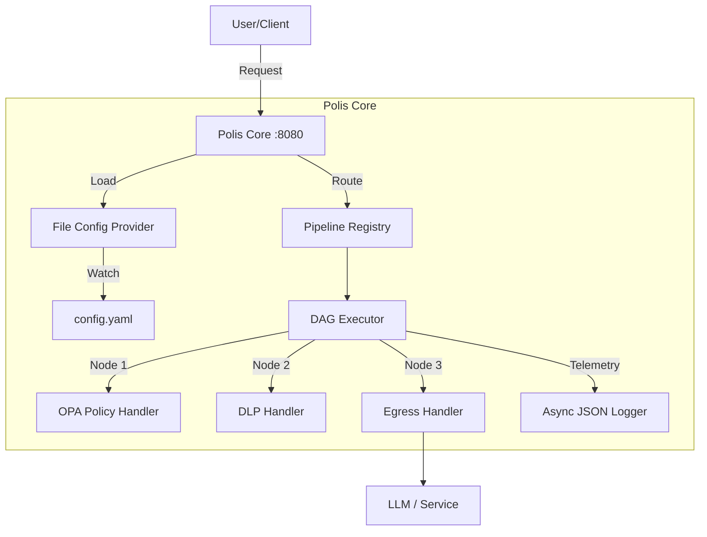

# Secure AI Proxy - Codebase Summary

> [!NOTE]
> **For Future Agents:** This file serves as the master index and "table of contents" for the entire codebase. It must be kept up-to-date as files are added, removed, or significantly modified. Do not remove details; the goal is to provide a comprehensive reference for understanding the purpose and functionality of every file.

## Overview
The **Secure AI Proxy** (Polis) is a high-performance, protocol-aware proxy designed to enforce zero-trust governance, policy enforcement, and observability for AI agent traffic. It intercepts requests, executes user-defined pipelines (DAG), and forwards validated traffic to upstream LLMs or services.

**Current Status:** Phase 1 (Open Source Core) Completed.

## High-Level Architecture

## Directory & File Index

### `cmd/` - Entry Points

#### `cmd/polis-core/`
*   **`main.go`**: The main entry point for the standalone open-source binary.
    *   `main()`: Bootstraps logging, config provider, in-memory storage, and starts the server.
    *   `watchConfig()`: Subscribes to configuration updates and reloads pipelines.
    *   `startServer()`: Initializes the HTTP server with the DAG handler.

#### `cmd/proxy/`
*   **`main.go`**: Legacy entry point, currently used for E2E testing.
    *   `run()`: Orchestrates the application lifecycle (telemetry, storage, server).
    *   `startAdminServer()`: Starts a minimal admin server for health checks.

### `pkg/config/` - Configuration Management

*   **`config.go`**: Defines the main `Config` struct and loading logic.
    *   `Load()`: Reads and parses configuration from a file.
*   **`file_provider.go`**: Implements `domain.ConfigService` using `fsnotify`.
    *   `NewFileConfigProvider()`: Initializes the file watcher.
    *   `Subscribe()`: Returns a channel for configuration updates.
    *   `watchLoop()`: Monitors file events and triggers reloads (debounced).
*   **`schema.go`**: Defines configuration structures for pipelines and policies.
    *   `Snapshot`: Represents the complete configuration state.
    *   `PipelineSpec`: JSON/YAML representation of a pipeline.
*   **`conversion.go`**: Converts configuration specs to domain models.
    *   `ToDomain()`: Helper methods for type conversion.
*   **`policy_types.go`**: Defines policy-related configuration types.
*   **`trust_bundle.go`**: Manages trusted CA certificates for mTLS.

### `pkg/domain/` - Domain Models

*   **`pipeline.go`**: Core pipeline definitions.
    *   `Pipeline`: Represents a processing pipeline.
    *   `PipelineNode`: A single step in the pipeline (e.g., auth, policy, egress).
    *   `PipelineContext`: Carries request/response data through the pipeline.
*   **`policy.go`**: Policy definitions.
    *   `Policy`: Represents an OPA policy.
    *   `Decision`: The result of a policy evaluation (Allow/Block/Redact).
*   **`config.go`**: Configuration interfaces.
    *   `ConfigService`: Interface for managing configuration snapshots.
*   **`governance.go`**: Governance definitions (Rate Limits, Circuit Breakers).
*   **`telemetry.go`**: Telemetry interfaces and types.
*   **`errors.go`**: Domain-specific error types.

### `pkg/engine/` - Core Execution Engine

*   **`executor.go`**: The heart of the proxy.
    *   `DAGExecutor`: Traverses the pipeline graph.
    *   `Execute()`: Processes a request through the DAG.
*   **`registry.go`**: Manages active pipelines.
    *   `PipelineRegistry`: Stores pipelines indexed by AgentID and Protocol.
    *   `UpdatePipelines()`: Hot-swaps the active pipeline set.
*   **`engine_factory.go`**: Creates and manages policy engines.
    *   `EngineFactory`: Initializes OPA engines for policy nodes.
*   **`http_handler.go`**: The HTTP entry point.
    *   `DAGHandler`: Implements `http.Handler`.
    *   `ServeHTTP()`: Wraps requests in `PipelineContext` and triggers the executor.
*   **`adapters_stub.go`**: Stub implementations for interfaces (likely for testing).

#### `pkg/engine/handlers/` - Node Handlers
*   **`policy.go`**: OPA Policy Handler.
    *   `Execute()`: Evaluates Rego policies against the request context.
*   **`dlp.go`**: Data Loss Prevention Handler.
    *   `DLPHandler`: Configures streaming response inspection.
    *   `inspectRequest()`: Scans content for PII.
*   **`egress_http.go`**: HTTP Egress Handler.
    *   `EgressHTTPHandler`: Forwards requests to upstream services.
    *   `Execute()`: Handles the upstream request/response cycle.
*   **`headers.go`**: Header manipulation handler.
*   **`body_buffer.go`**: Utilities for buffering request/response bodies.

### `pkg/logging/` - Logging

*   **`logger.go`**: Structured logging setup.
    *   `SetupLogger()`: Configures `zerolog` for async JSON (prod) or pretty console (dev) output.

### `pkg/policy/` - Policy Engine

*   **`engine.go`**: OPA Engine wrapper.
    *   `OPAEngine`: Manages OPA query evaluation.
*   **`policy.go`**: Policy domain logic.

#### `pkg/policy/dlp/` - Data Loss Prevention
*   **`scanner.go`**: Regex-based PII scanner.
    *   `Scanner`: Holds compiled regex rules.
    *   `Scan()`: Applies rules to text and returns findings/redactions.
*   **`registry.go`**: Registry of DLP rules.
*   **`stream_redactor.go`**: Streaming redaction logic.

### `pkg/telemetry/` - Observability

*   **`provider.go`**: OpenTelemetry provider setup.
    *   `SetupProvider()`: Configures OTLP exporters for traces and metrics.

### `internal/storage/` - Storage Layer

*   **`memory_store.go`**: In-memory implementation of storage interfaces.
    *   `MemoryPolicyStore`: Stores policies in RAM (thread-safe).
*   **`policy_store.go`**: Interface definitions for policy storage.

### `internal/governance/` - Governance Logic

*   **`circuitbreaker.go`**: Circuit breaker implementation.
*   **`ratelimit.go`**: Rate limiter implementation.
*   **`timeouts_retries.go`**: Timeout and retry logic.

### `tests/` - Testing

*   **`e2e/`**: End-to-End tests.
    *   `harness.go`: Test harness for spinning up the proxy and mock upstreams.
    *   `llm_test.go`: Tests for LLM streaming and auth.
*   **`integration/`**: Integration tests.
    *   `access_policy_test.go`: Tests for access control policies.
    *   `cost_policy_test.go`: Tests for cost control policies.
*   **`contract/`**: Contract tests (currently empty/placeholder).
*   **`perf/`**: Performance tests.

---
*Last Updated: 2025-11-30*
