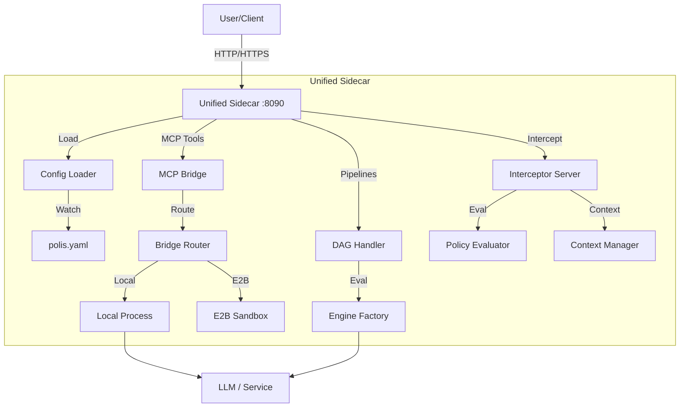

# Secure AI Proxy (Polis) - Codebase Summary

> [!NOTE]
> **For Future Agents:** This file serves as the master index and "table of contents" for the entire codebase. It must be kept up-to-date as files are added, removed, or significantly modified. Do not remove details; the goal is to provide a comprehensive reference for understanding the purpose and functionality of every file.

## Overview
The **Secure AI Proxy** (Polis) is a high-performance, protocol-aware proxy designed to enforce zero-trust governance, policy enforcement, and observability for AI agent traffic. It intercepts requests, executes user-defined pipelines (DAG), and provides a Model Context Protocol (MCP) bridge for tools.

**Current Status:** Phase 1 (Open Source Core) & Unified Sidecar Integration Completed.
**Technical Reference:** For a deep-dive into the Secure Triad architecture and request lifecycles, see the [Comprehensive Architecture Reference](file:///c:/Users/adam/Desktop/startup/polis-oss/docs/comprehensive_architecture_reference.md).

## High-Level Architecture

## Directory & File Index

### `cmd/` - Entry Points

#### `cmd/polis/`
*   **`main.go`**: The **Unified** entry point for the Sidecar.
    *   Loads unified configuration (or auto-adapts legacy formats).
    *   Starts multiple HTTP/HTTPS listeners (default :8090, :8443).
    *   Orchestrates the lifecycle of the Bridge (MCP), DAG Handler (Pipelines), and Interceptor.

#### `cmd/polis-cert/`
*   **`main.go`**: CLI tool for generating TLS certificates (CA, Server, Client) for secure communication.

#### `cmd/polis-core/` (Legacy)
*   **`main.go`**: Previous standalone entry point. Preserved for reference/migration.

### `pkg/sidecar/` - Unified Sidecar Core
The orchestration layer that connects configuration to runtime components.
*   **`sidecar.go`**: Main struct wiring Bridge, DAG Handler, and Interceptor.
*   **`config.go`** & **`config_loader.go`**: Definition of `SidecarConfig` (schema-aware) and hot-reloading loader.
*   **`bridge_router.go`**: Routes tool execution requests to appropriate runtimes (Local/E2B).
*   **`interceptor.go`**: Handles request interception for auditing and pre-execution policy checks.
*   **`context_manager.go`**: Manages ephemeral request contexts and decision storage.
*   **`process_manager.go`** & **`local_process_manager.go`**: Abstraction for managing subprocesses (Local process management with Windows pipe resilience).
*   **`secrets.go`**: Specialized Redaction logic for PII and secrets in intercepted traffic.
*   **`serialization.go`**: Helper for protocol-aware serialization (SSE/JSON-RPC).

### `pkg/bridge/` - MCP Bridge Core
Implements the Model Context Protocol (MCP) as an embedded component.
*   **`bridge.go`**: Manages MCP server lifecycle and tool registration.
*   **`session_manager.go`**: Tracks active SSE sessions and JSON-RPC state.
*   **`sse.go`**: Implements Server-Sent Events for tool status and output streaming.
*   **`stream_inspector.go`**: Inspects tool outputs (stdout/stderr) for policy violations.
*   **`metrics.go`**: Captures bridge-specific telemetry (tool usage, durations).
*   **`middleware.go`**: Auth and agent-identification middleware for bridge endpoints.

### `pkg/config/` - Configuration Management
*   **`config.go`**: Main `Config` struct (Unified schema) and loading logic.
*   **`schema.go`**: Defines structures for pipelines, policies, and snapshots.
*   **`tls_types.go`**: Detailed configuration for TLS termination and client auth.
*   **`policy_bundle.go`**: Manages OPA rego bundles as first-class citizens.
*   **`file_provider.go`**: Implements `fsnotify`-based configuration watching.
*   **`trust_bundle.go`**: Manages trusted CA sets.

### `pkg/engine/` - Pipeline Execution Engine
*   **`executor.go`**: Core logic for traversing the pipeline DAG.
*   **`registry.go`**: Manages active pipelines with support for hot-swaps.
*   **`engine_factory.go`**: Initializes and caches OPA policy engines.
*   **`http_handler.go`**: `DAGHandler` implementation that exposes pipelines via HTTP.
*   **`egress_http.go`**: Handles upstream communication, including HTTPS CONNECT tunneling.

#### `pkg/engine/handlers/` - Node Handlers
*   **`policy.go`**: Evaluates OPA/Rego policies.
*   **`dlp.go`**: Data Loss Prevention handler with SSE-aware streaming support.
*   **`mcp_filter.go`**: Enforces fine-grained tool permissions for MCP JSON-RPC messages.
*   **`llm_judge/`**: LLM-as-Judge implementation for content evaluation.

### `internal/tls/` - TLS Support
*   **`tls.go`**: Core TLS configuration utilities (MinVersion, CipherSuites).
*   **`server.go`**: Custom TLS listener implementation for robust handshake handling.

### `pkg/domain/` - Domain Models & Interfaces
*   Fundamental interfaces for `Pipeline`, `Policy`, `Governance`, and `Telemetry`.

### `pkg/logging/` - Structured Logging
*   **`logger.go`**: Configures the standard `log/slog` library for JSON or text output.

### `tests/` - Testing Suite
*   **`e2e/`**: End-to-end tests for the unified `polis` binary.
*   **`integration/`**: Tests for specific governance scenarios (Access, Cost, PII).
*   **`pkg/bridge/testdata`**: Mock tools and configurations for bridge testing.

---
*Last Updated: 2025-12-26*
