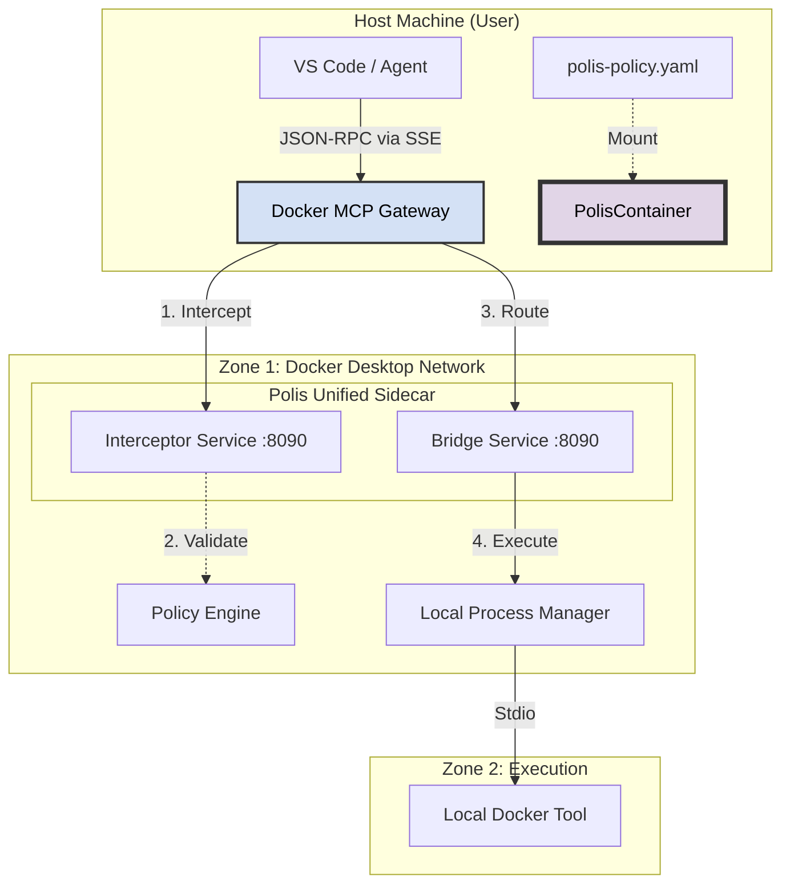

# Unified Sidecar Migration Plan

## 1. Executive Summary
This document outlines the architectural consolidation of `polis-core` (Governance) and `polis-bridge` (MCP Server) into a single, unified Docker container: the **Polis Unified Sidecar**.

**Objective**: Simplify deployment and reduce latency by running a single "Sidecar" container that integrates with the Docker MCP Gateway.
**Scope**: This phase focuses purely on **Local Docker Execution**. E2B and NixOS are explicitly *excluded* from this implementation but the interfaces are designed to support them in Phase 2.

---

## 2. Target Architecture (Phase 1: Docker Only)

### The "Unified Sidecar" Concept
Instead of running two separate services (`proxy` and `bridge`), we run a single `polis` binary inside a Docker container. This binary runs two parallel HTTP servers/listeners:
1.  **Interceptor API (Port 8090)**: Handles Docker Gateway traffic (Policy Enforcement).
2.  **MCP Server API (Port 8090)**: Handles tool execution requests (The "Bridge" functionality).

### System Topology



### Key Changes from Current State
1.  **Merged Binary**: `polis-bridge` code is moved into `polis-core`.
2.  **Dual Listeners**: The main `cmd/polis` entrypoint spawns goroutines for both the Interceptor and the Bridge.
3.  **Local Execution**: The `ProcessManager` defaults to a `LocalDockerProcessManager` that uses generic Docker containers or Bind Mounts, rather than E2B.

---

## 3. Interfaces for Future Extensibility (The "E2B Gap")
Although we are not implementing E2B yet, the architecture prepares for it via the `ProcessManager` interface.

```go
// The Unified Sidecar uses this Interface
type ProcessManager interface {
    Start(ctx context.Context, cmd Command) (Process, error)
}

// Phase 1 (Now): Local Docker Implementation
type LocalDockerProcessManager struct {
    // Uses os/exec or docker-cli to run tools locally
}

// Phase 2 (Future): E2B Implementation
type E2BProcessManager struct {
    // Uses E2B SDK to run tools in microVMs
}
```

By strictly adhering to this interface, swapping "Local Docker" for "E2B" becomes a configuration change (`type: e2b`), not an architectural rewrite.

---

## 4. Configuration Consolidation
We move from disparate config files to a single canonical `polis-policy.yaml`.

**Old**: `mcp_config.json` + `config.yaml`
**New**: `polis-policy.yaml`

```yaml
apiVersion: polis.io/v1
kind: Policy
metadata:
  name: local-dev
spec:
  # Interceptor Configuration
  governance:
    mode: "blocking"
    
  # Bridge Configuration (The Tools)
  tools:
    - name: "git-helper"
      driver: "local-docker" # Phase 1 Choice
      image: "alpine/git"
      # driver: "e2b"        # Phase 2 Choice (Future)
```
