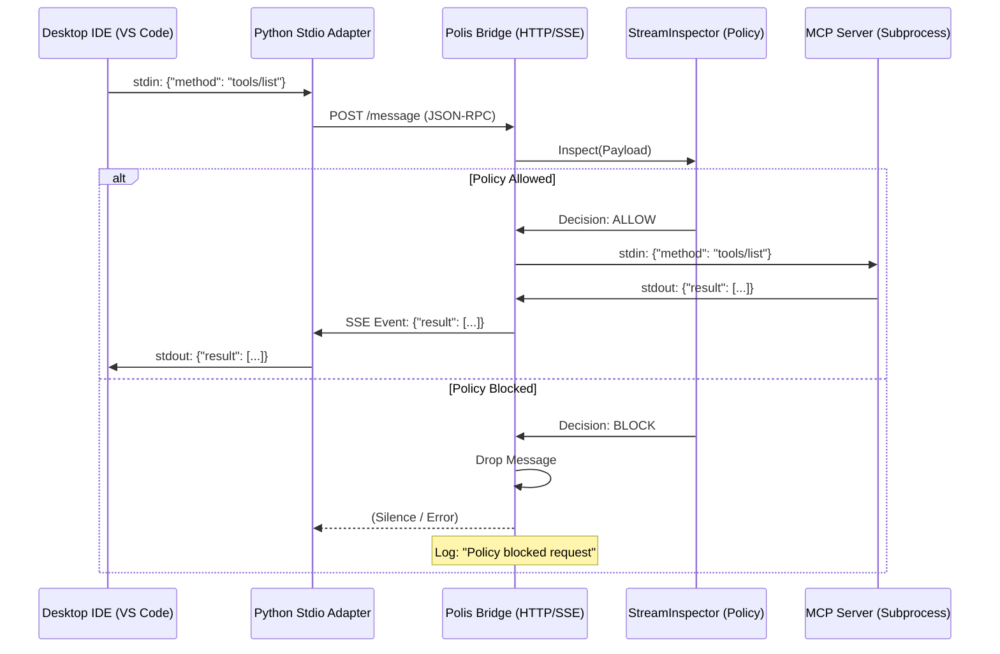

# Polis OSS System Architecture & MCP Capabilities

This document provides a detailed technical overview of the **Polis OSS** platform, specifically focusing on its **Model Context Protocol (MCP)** governance capabilities. It serves as the primary context for evaluating the feasibility of hosting the Polis Bridge in a Dockerized environment while maintaining seamless integration with local Desktop IDEs (VS Code, Windsurf).

---

## 1. System Overview

**Polis** is a governance, observability, and security layer for AI agents. It acts as a middleware that intercepts, inspects, and enforces policies on traffic between AI agents (or IDEs) and the tools/services they access.

The platform consists of two main components:
1.  **Polis Core (`polis.exe`)**: The central policy engine and data plane.
2.  **Polis Bridge (`polis-bridge`)**: A specialized protocol adapter for MCP.

## 2. Component: Polis Core (`polis.exe`)

**Role**: Centralized Governance Server.

`polis.exe` is a high-performance HTTP/GRPC server designed to handle traffic from multiple sources (not just MCP). It creates a "Chain of Governance" through configurable pipelines.

**Key Capabilities**:
*   **Pipeline Architecture**: traffic flows through a series of modular filters (Nodes).
*   **PII Detection**: Automatic redaction of sensitive data (Personally Identifiable Information) using specialized regex processors and logical checks.
*   **OPA Engine Integration**: Deep integration with Open Policy Agent (OPA) for fine-grained, attribute-based access control (ABAC).
*   **Audit Logging**: Comprehensive, structured logging of all requests and policy decisions for compliance.
*   **TLS Termination**: Handles secure connections for enterprise deployments.

*Current State*: While capable of handling general API traffic, `polis.exe` can act as a "Gateway" for the `polis-bridge`, enforcing centralized policies on MCP traffic offloaded by the bridge.

## 3. Component: Polis Bridge (`polis-bridge`)

**Role**: MCP Protocol Adapter & Policy Enforcement Point (PEP).

`polis-bridge` is a specialized server that bridges the communication gap between **HTTP/SSE (Server-Sent Events)** clients (like Remote IDEs or Agents) and **Stdio-based** MCP Servers (like local tools running as subprocesses).

**Key Architectures**:
1.  **Transport Bridging**: Converts JSON-RPC messages between HTTP/SSE streams and the Stdin/Stdout of a managed subprocess.
2.  **Session Management**: Maintains stateful sessions (`X-Session-ID`) allows clients to disconnect and reconnect (e.g., browser refresh, network glitch) without killing the underlying tool process.
3.  **Governance Layer (`StreamInspector`)**:
    *   **Fail-Closed Security**: By default, if policies cannot be loaded, all traffic is blocked.
    *   **Embedded Policy Engine**: Risks are evaluated locally using OPA/Rego policies defined in configuration.
    *   **Prompt Injection Protection**: Blocks server-initiated `sampling/createMessage` requests that match malicious patterns (e.g., "ignore previous instructions").
    *   **Logging**: Emits structured logs for every message, recording `action: allow/block` and the reasoning.

## 4. MCP Governance Workflow

The diagram below illustrates the flow of a governed MCP interaction:

## 5. Research Objective: Dockerization & IDE Integration

The current implementation assumes `polis-bridge` runs **locally** on the user's machine (Windows/Mac/Linux). This allows the managed MCP Server (e.g., `git`, `filesystem`) to access the user's local files.

**The Goal**: Move `polis-bridge` (and potentially the MCP servers it manages) into a **Docker Container**.

**The Challenge**:
1.  **Filesystem Access**: If the Bridge + MCP Server run in Docker, how does the MCP Server access the user's local project files on the host machine? (Volume mounts are clear, but is the UX acceptable?)
2.  **Network Connectivity**: IDEs like VS Code natively speak Stdio for MCP. We use a `python adapter` to talk to the Bridge. If the Bridge is in Docker, the adapter must connect to `localhost:8090` (mapped port).
3.  **Process Management**: The Bridge manages child processes. In Docker, these processes exist only inside the container.
4.  **DevEx**: Can we provide a seamless "one-click" experience where the user starts a container, points their IDE to it, and gets governed access to tools, effectively sandboxing the tools?

---

## 6. Prompt for Research Agent

**Agent Task**: Research & Feasibility Analysis for Dockerized MCP Governance

**Context**: 
We have a working OS-level bridge (`polis-bridge`) that governs MCP servers. We want to containerize this solution to provide a secure, sandboxed environment for running untrusted MCP tools, while still allowing developers to use them from their local IDEs (VS Code, Windsurf).

**Prompt**:
> "Analyze the feasibility of hosting `polis-bridge` inside a Docker container to govern MCP servers.
>
> Your research must answer the following:
> 1.  **Architecture**: Design a deployment pattern where `polis-bridge` runs in Docker/Compose, exposing its HTTP/SSE port to the host.
> 2.  **Filesystem Strategy**: Determine the best way to expose the host's project directory to the containerized MCP server (e.g., `@modelcontextprotocol/server-filesystem`) so that the IDE user can still work on their local files. Compare Volume Mounts vs. Bind Mounts vs. Copying.
> 3.  **Connectivity**: Verify if the local Python Adapter (running on Host) can successfully perform the SSE handshake with the containerized Bridge.
> 4.  **Security**: Does this improve security? (e.g., The malicious tool is now trapped in the container).
> 5.  **UX Limitations**: What friction does this add for the user? (e.g., 'You must mount your C: drive').
>
> Output a **Feasibility Report** recommending whether we should pursue this 'Sandboxed Bridge' strategy officially."
